# Guardians

## Copyright

Die Monster und ihre Sprites sind unter Creative Commons 4.0 (CC-BY-4.0) lizensiert. Das bedeutet, du kannst sie überall mit nur wenigen Einschränkungen nutzen. Das dient nur dazu, dass die Monster überall unter den gleichen Namen bekannt sind. Regeln:

* gib immer die Quelle der Monster an: Georg Eckert / limbusdev
* nutze immer die hier gegebenen Namen
* die Lizenz gilt nur für die Sprites hier und hat keinen Einfluss auf deinen Code
* darüberhinaus kannst du damit tun, was du möchtest

## Übersetzungen

* [Englisch](./Guardians.md)

## Encyclo

Vollständige Liste aller bisher erschienenen Guardian Monsters.

|ID         |Name       |Sprite                 |16x16                  |3D |Description|Name Origin            |
|-----------|-----------|-----------------------|-----------------------|---|-----------|-----------------------|
|0_0        |Ei         |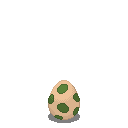 |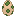   |   |           |                       |
|1_0        |Waldin     | |   |   |           |Forest dinosaur        |
|1_1        |Stegowal   | |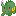   |   |           |Stegosaurus forest     |
|1_2        |Brachiwal  | |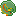   |   |           |Brachiosaurus forest   |
|2_0        |Kroki      | |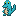   |   |           |Crocodile              |
|2_1        |Vipakrok   | |                       |   |           |Crocodile viper        |
|2_2        |Leviadil   | |                       |   |           |Leviathan crocodile    |
|3_0        |Teudin     | |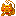   |   |           |Devil dinosaur         |
|3_1        |Teudra     | |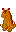   |   |           |Devil dragon           |
|3_2        |Teuraptor  | |                       |   |           |Devil raptor           |
|4_0        |Ludin      | |                       |   |           |Air dinosaur           |
|4_1        |Winreh     | |                       |   |           |Air deer               |
|4_2        |Sturwild   | |                       |   |           |Air stag               |
|5_0        |Marsel     |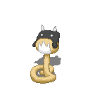 |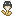   |   |           |Weasel toat            |
|6_0        |Muni       |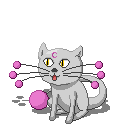 |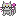   |   |           |Moon kitty             |
|6_1        |Kaluna     |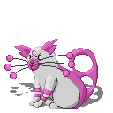 |                       |   |           |Cat moon               |
|6_2        |Leoluna    |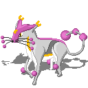 |                       |   |           |Moon leopard           |
|7_0        |Wulpi      |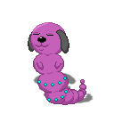 |                       |   |           |Worm puppy             |
|7_1        |Hundohr    |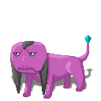 |                       |   |           |Ear dog                |
|7_2        |Hundifer   |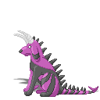 |                       |   |           |Demon dog              |
|8_0        |Dratter    |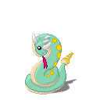 |                       |   |           |Dread adder            |
|8_1        |Driper     |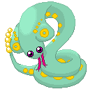 |                       |   |           |Dread viper            |
|9_0        |Augops     |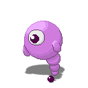 |                       |   |           |Spring eye             |
|9_1        |Augfalter  |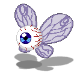 |                       |   |           |Butterfly eye          |
|10_0       |Doppmad    |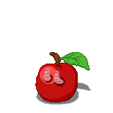|                       |   |           |Double maggot          |
|10_1       |Wurbien    |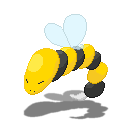|                       |   |           |Bee worm               |
|11_0       |Staupi     |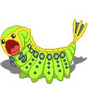|                       |   |           |Marvellous caterpillar |
|11_1       |Staumantis |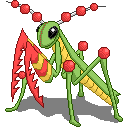|                       |   |           |Marvellous mantis      |
|12_0       |Paltopf    |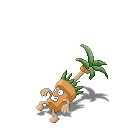|                       |   |           |Palmtree pot           |
|12_1       |Nasai      |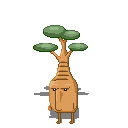|                       |   |           |Bonsai nose            |
|13_0       |Erimind    |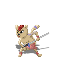|                       |   |           |Hermit aspirant        |
|13_1       |Erikat     |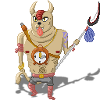|                       |   |           |Hermit chief           |
|14_0       |Schlupfei  |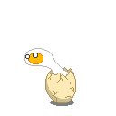|                       |   |           |Hatching egg           |
|14_1       |Euloss     |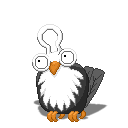|                       |   |           |Owl lock               |
|15_0       |Puddge     |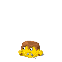|                       |   |           |Flummery boy           |
|15_1       |Puddsel    |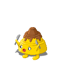|                       |   |           |Flummery stack         |
|16_0       |Neptisch   |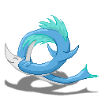|                       |   |           |Neptun fish            |
|16_1       |Nepche     |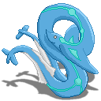|                       |   |           |Neptun dragon          |
|16_2       |Nepugander |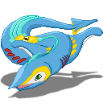|                       |   |           |Neptun Jörmungandr     |
|17_0       |Engtenn    |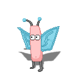|                       |   |           |Angel antenna          |
|17_1       |Engnas     |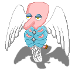|                       |   |           |Angel nose             |
|17_2       |Aethengel  |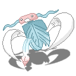|                       |   |           |Aetherical angel       |
|18_0       |Quawel     |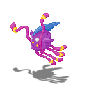|                       |   |           |Jewel jellyfish        |
|18_1       |Wawel      |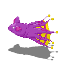|                       |   |           |Jewel whale            |
|18_2       |Oktowel    |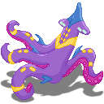|                       |   |           |Jewel octopus          |
|19_0       |Kuki       |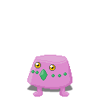|                       |   |           |Cake boy               |
|19_1       |Kukel      |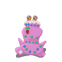|                       |   |           |Cake stack             |
|19_2       |Lolliku    |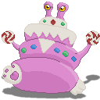|                       |   |           |Candy cake             |
|20_0       |Spifer     ||                       |   |           |Spider beetle          |
|20_1       |Marispinn  |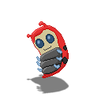|                       |   |           |Spider ladybug         |
|20_2       |Hirspinn   |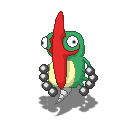|                       |   |           |Spider hercules bug    |
|21_0       |Hasupf     |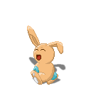|                       |   |           |Bunny                  |
|21_1       |Hasops     |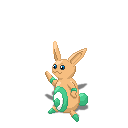|                       |   |           |Bigger bunny           |
|21_2       |Habox      |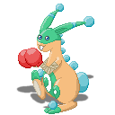|                       |   |           |Boxer bunny            |
|22_0       |Fieli      |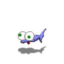|                       |   |           |Squinting fish         |
|22_1       |Bagisch    ||                       |   |           |Bagel fish             |
|23_0       |Rolander   ||                       |   |           |Pink salamander        |
|24_0       |Binoraffe  ||                       |   |           |Binocular giraffe      |
|25_0       |Darmpa     ||                       |   |           |Transparent gastronomy |
|26_0       |Fedall     ||                       |   |           |Spring ball            |
|26_1       |Grimall    ||                       |   |           |Grim ball              |
|27_0       |Leitflies  ||                       |   |           |Circuit board fleece   |
|27_1       |Quantus    ||                       |   |           |Quantum rhombus        |
|28_0       |Spektri    ||                       |   |           |Spectrum bug           |
|29_0       |Uhron      ||                       |   |           |Clock                  |
|30_0       |Klingtaur  ||                       |   |           |Saber tooth zentaur    |
|31_0       |Flicktier  ||                       |   |           |Patch animal           |
|32_0       |Bartagon   ||                       |   |           |Mustage hexagon        |
|33_0       |Chamirm    ||                       |   |           |Charmeleon umbrella    |
|34_0       |Matreul    ||                       |   |           |Suit owl               |
|35_0       |Haschum    ||                       |   |           |Glove demon            |
|36_0       |Tiivii     ||                       |   |           |Screen caterpillar     |
|37_0       |Krausbaer  ||                       |   |           |Ruff coon              |
|38_0       |Schnemp    ||                       |   |           |Hitchiking snail       |
|39_0       |Blibaer    ||                       |   |           |Flash bear             |
|40_0       |Streiguin  ||                       |   |           |Striped penguin        |
|41_0       |Flugsau    ||                       |   |           |Pig aircraft           |
|42_0       |Furm       ||                       |   |           |Spring worm            |
|42_1       |Kugurm     ||                       |   |           |Sphere snake           |
|42_2       |Mahlsturm  ||                       |   |           |Mill lord              |
|43_0       |Auschel    ||                       |   |           |Shell eye              |
|43_1       |Fingkrabb  ||                       |   |           |Shell crab             |
|44_0       |Roton      ||                       |   |           |Android ton            |
|44_1       |Roban      ||                       |   |           |Android main           |
|45_0       |Frettel    ||                       |   |           |Ferret shell           |
|45_1       |Frettild   ||                       |   |           |Ferret armor           |
|45_2       |Frettat    ||                       |   |           |Ferret warrior         |
|46_0       |Fummke     ||                       |   |           |Candle snail           |
|46_1       |Flammke    ||                       |   |           |Blasting snail         |
|46_2       |Leuchke    ||                       |   |           |Chandelier snail       |
|47_0       |Kixi       ||                       |   |           |Witch kitty            |
|47_1       |Makat      ||                       |   |           |Magical cat            |
|47_2       |Zaubart    ||                       |   |           |Wizard mane            |
|47_3       |Magilion   ||                       |   |           |Wizard sovereign       |
|48_0       |Kumihol    ||                       |   |           |Kumiho eol-eum         |
|49_0       |Choros     ||                       |   |           |greek: space           |
|50_0       |Ora        ||                       |   |           |greek: time            |
|51_0       |Spinnfix   ||                       |   |           |Spider shell           |
|51_1       |Spinnion   ||                       |   |           |Spider scorpion        |
|51_2       |Spidat     ||                       |   |           |Spider warrior         |

