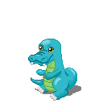
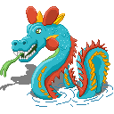

[Fordin <](./1.md) Kroki [> Devidin](./3.md)

# 2 - Kroki

# Metamorphosis

|Metaform 1                 |Metaform 2                 |Metaform 3                 |
|---------------------------|---------------------------|---------------------------|
|    |    |    |
|Kroki                      |Krokivip                   |Leviadile                  |

## Description

Kroki is one of the first four Guardians mentioned in the ancient scripts about the Singularity. It protects everything on and under the sea.
