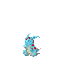
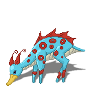
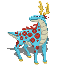

[Devidin <](./3.md) Aerodin [> Westoat](./4.md)

# 4 - Aerodin

# Metamorphosis

|Metaform 1                 |Metaform 2                 |Metaform 3                 |
|---------------------------|---------------------------|---------------------------|
|    |    |    |
|Aerodin                    |Aerodeer                   |Aerostag                   |

## Description

Aerodin is one of the first four Guardians mentioned in the ancient scripts about the Singularity. It protects everything in the air.
